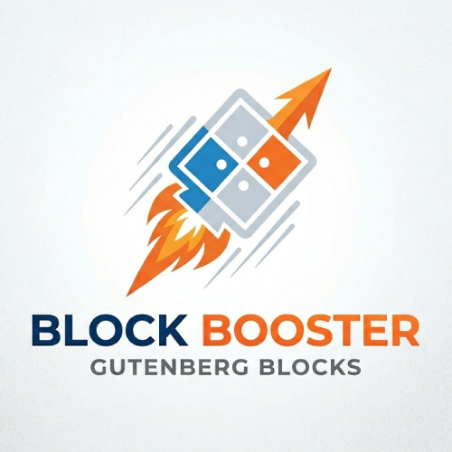
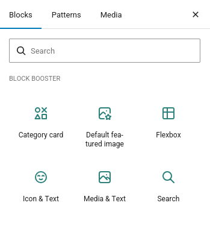
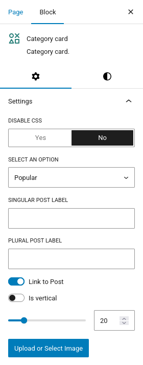
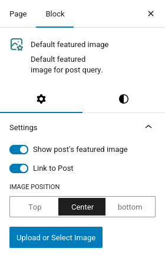
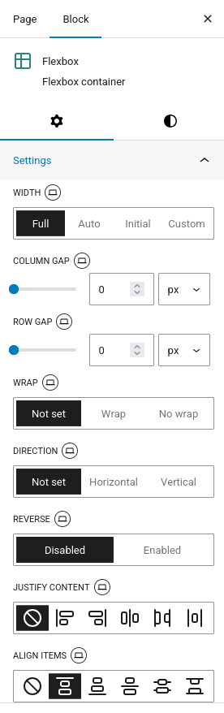
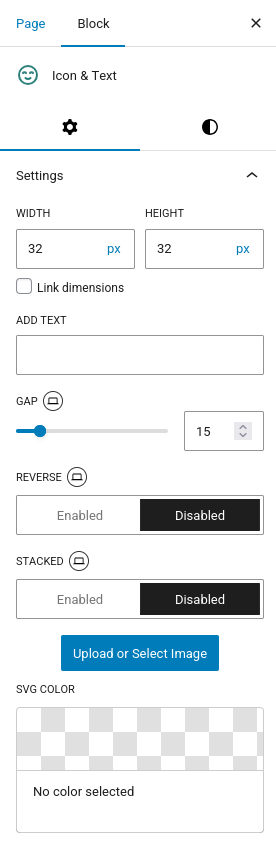
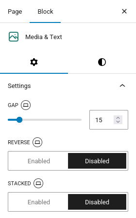
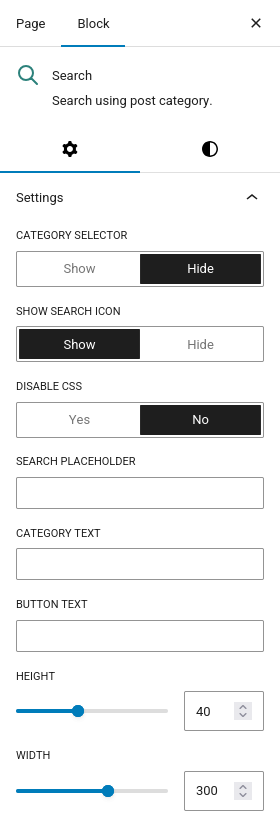

<p align="center">
  
</p>

# Block Booster

**Block Booster** is a collection of custom Gutenberg blocks designed to enhance the WordPress block editor. It provides responsive, feature-rich blocks that go beyond what the core blocks offer — with full control over layout, responsive breakpoints, and visual customization.



## Features

- 6 custom blocks registered under a dedicated **Block Booster** category
- Fully responsive controls with per-device settings (Desktop / Tablet / Mobile)
- Server-side rendering for optimal frontend performance
- Scoped inline styles — no global CSS conflicts
- SVG-aware components with inline rendering and color customization
- Compatible with WordPress 6.7+ and PHP 7.4+

## Blocks

### Category Card

Displays a WordPress category as a visual card with a circular image, category name, and post count. Ideal for building category index or landing pages.

- Select any category from a dropdown
- Upload a custom circular image with live resizing
- Horizontal or vertical layout
- Custom singular/plural post count labels (e.g. "Article" / "Articles")
- Optional link to category archive
- Adjustable gap between image and text
- Supports background color, text color, typography, spacing, and shadow



### Default Featured Image

Displays a post's featured image with a fallback to a user-uploaded default image. Designed for use inside Query Loop blocks, so posts without a featured image still look consistent.

- Integrates with Query Loop context (`postId`, `postType`)
- Toggle between the post's actual featured image and a fallback
- Image position control (Top / Center / Bottom)
- Resizable container height
- Optional link to the post
- Supports border, shadow, background, typography, and spacing



### Flexbox

A powerful, fully-configurable CSS Flexbox container that accepts any inner blocks. Provides granular responsive control over every flex property — perfect for building complex layouts without custom CSS.

- All flex properties: direction, wrap, justify-content, align-items, grow, shrink
- Width mode: Full / Auto / Initial / Custom (with unit selector)
- Independent column gap and row gap with unit selectors
- Reverse direction toggle
- Display control per breakpoint (flex / inline-flex / none — hide on specific devices!)
- Every property has Desktop / Tablet / Mobile variants
- Visual icon-based controls for alignment and justification
- Supports wide alignment, background image, shadow, color, typography, and spacing



### Icon & Text

Displays an icon or image alongside text content. Supports SVG icons with color customization — ideal for feature lists, icon boxes, and USP sections.

- Upload any image or SVG icon
- SVGs are inlined automatically for color control via a palette picker
- Independent width and height controls with unit selectors (px, %, em)
- Option to lock dimensions together
- Responsive gap, reverse, and stacked toggles per breakpoint
- Quick-reverse toolbar button
- Supports text alignment and background image



### Media & Text

A two-column layout with media on one side and rich content (via inner blocks) on the other. An enhanced alternative to the core Media & Text block with full responsive controls.

- Upload a media image for the left column
- Right column accepts any inner blocks
- Responsive gap, reverse, and stacked toggles per breakpoint
- Quick-reverse toolbar button
- 50/50 column split by default
- Supports background, color, typography, and spacing



### Search

A customizable search form with an optional category filter dropdown and search icon. An enhanced replacement for the core Search block.

- Optional category dropdown filter (auto-populated from WordPress categories)
- Toggle between a search icon button and a text button
- Custom placeholder text, button text, and category label
- Resizable height and width with visual drag handles
- Pill-shaped styled variant with smart layout proportions
- Disable CSS option for full custom styling
- Submits as a standard WordPress search form with optional category filtering



## Responsive Breakpoints

| Device  | Breakpoint    |
| ------- | ------------- |
| Mobile  | ≤ 600px       |
| Tablet  | 601px – 992px |
| Desktop | ≥ 993px       |

## Requirements

- WordPress 6.7 or higher
- PHP 7.4 or higher

## Installation

1. Upload the `block-booster` folder to `/wp-content/plugins/`
2. Activate the plugin through the **Plugins** screen in WordPress
3. Open the block editor — all Block Booster blocks appear under the **Block Booster** category in the block inserter

## Development

```bash
# Install dependencies
npm install

# Start development with hot reload
npm start

# Build for production
npm run build

# Create a plugin zip
npm run plugin-zip
```

## License

GPL-2.0-or-later — [https://www.gnu.org/licenses/gpl-2.0.html](https://www.gnu.org/licenses/gpl-2.0.html)

## Author

**Tahir Asadli**
